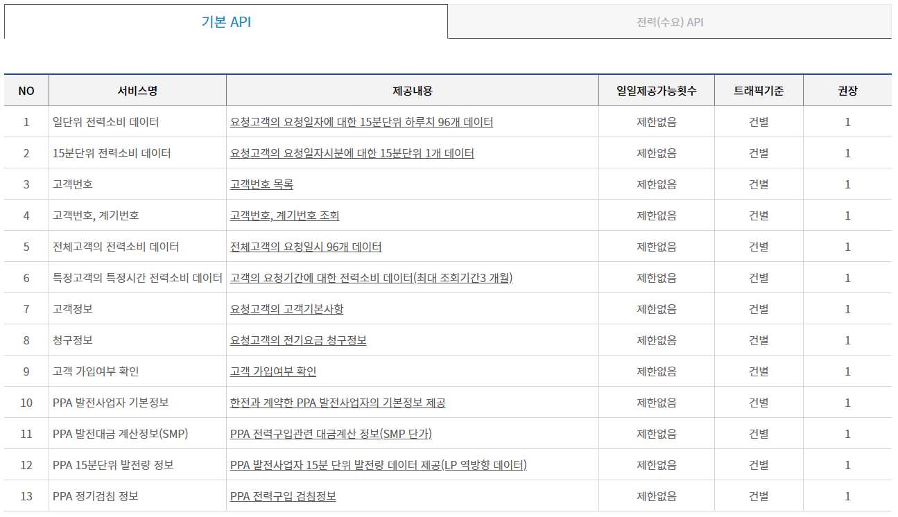
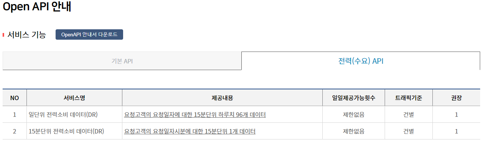

## 팀 프로젝트 final

1. 문서화

- 회의록 -> Jira 활용
- 페어프로그래밍 -> github, 화면공유
- 한 명이 담당하는 파트 명시

- airflow 적용 데이터 수집 파이프라인
- spark, kafka 도입 고민
- Jira 관리

2. 주제

- 건물별 전력 사용량 예측

  - 전력: [Open API](https://opm.kepco.co.kr/cmsmain.do?scode=S01&pcode=000187&redirect=Y#n)

   

  - 
  - 

 

- 건물 정보(Vworld API): [Open API](https://www.vworld.kr/dev/v4dv_apiuse_s001.do)

- 직방 api: [Request 사용법](https://investraveler.tistory.com/155)

 

- 관련 데이콘 대회

  - 하지만 주체측에서 제공하는 데이터셋을 써야하는 제한 사항 있음
    - [데이터 예시](https://dacon.io/competitions/official/236125/data)
  - 참여 기간(7.17~8.28)
    - https://dacon.io/competitions/official/236125/overview/description

 
 
 

1. **금융 거래 데이터**를 수집, 처리, 분석하고, 부정 거래 탐지 및 위험 관리를 수행하는 프로젝트

- 이 프로젝트의 목적은 다양한 금융 기관으로부터 금융 거래 데이터를 수집, 처리, 분석하고,
- 최종적으로 부정 거래 탐지 및 위험 관리를 수행하는 것입니다.

- 이 프로젝트의 구성 요소는 다음과 같습니다:

- 데이터 수집: REST, SOAP, gRPC 등의 프로토콜을 사용하여 은행, 카드사, 증권사 등의 금융 기관으로부터 금융 거래 \
  데이터를 수집합니다. 이 과정에서 Docker 컨테이너를 사용하여 실행되는 데이터 수집 기능을 구현합니다.

- 데이터 스트림 파이프라인: Kafka 또는 Pulsar와 같은 메시징 시스템을 사용하여 수집한 \
  금융 거래 데이터를 실시간으로 확장 가능한 스트림으로 전송합니다. \
  이에 쿠버네티스 배포를 사용하여 메시징 서비스를 구성 및 관리합니다.

- 데이터 처리 및 전처리: Spark Streaming, Flink, Storm 등의 스트림 처리 엔진을 사용하여 스트리밍 된 데이터를 처리하고 가공합니다. 쿠버네티스에서 실행되는 스트림 처리 엔진의 클러스터를 설정하여 분산 처리를 담당하게 합니다.

- 데이터 저장소: 전처리된 데이터를 MySQL, PostgreSQL, BigQuery 등의 DBMS 및 데이터 웨어하우스에 저장합니다. 이러한 데이터베이스에 대한 쿠버네티스 서비스 및 배포를 구성하여 클러스터 내에서 접근 및 관리가 가능하도록 합니다.
  분석 및 부정 거래 탐지 및 위험 관리 도출: ML 및 AI 기술, 예를 들면 TensorFlow, scikit-learn, PyTorch 등의 라이브러리와 도구를 사용하여 금융 거래 데이터를 분석하고, 부정 거래 탐지 및 위험 관리를 수행하는 결과를 도출합니다. 필요한 경우, 머신 러닝 워크로드에 대해 쿠버네티스 클러스터를 설정하여 학습과 추론과정을 수행할 수 있습니다.

- 시각화 및 결과 제공: 구축된 결과를 대시보드 형식으로 시각화, 표현하기 위해 Grafana, Kibana, 또는 Tableau와 같은 도구를 사용합니다. 이러한 도구를 쿠버네티스 클러스터 내에서 배포하고 설정하여 전체 시스템을 통합적으로 관리할 수 있습니다.

 
 

2. **뉴스 기사 데이터**를 수집, 처리, 분석하고, 뉴스 요약 및 키워드 추출 시스템을 구축하는 프로젝트입니다.

- 이 프로젝트의 목적은 다양한 온라인 소스로부터 뉴스 기사 데이터를 수집, 처리, 분석하고, 최종적으로 사용자에게 뉴스 요약 및 키워드 추출 시스템을 제공하는 것입니다.

- 데이터 수집: 네이버 뉴스, 구글 뉴스, CNN 등의 오픈 API를 사용하여 뉴스 기사 데이터를 수집합니다. 이 과정에서 Docker 컨테이너를 사용하여 실행되는 데이터 수집 기능을 구현합니다.

- 데이터 처리 및 전처리: Pandas, Numpy, Dask 등의 데이터 분석 라이브러리를 사용하여 수집한 뉴스 기사 데이터를 처리하고 가공합니다. 쿠버네티스에서 실행되는 데이터 분석 기능의 파드를 설정하여 분산 처리를 담당하게 합니다.

- 데이터 저장소: 전처리된 뉴스 기사 데이터를 MySQL, PostgreSQL, BigQuery 등의 DBMS 및 데이터 웨어하우스에 저장합니다. 이러한 데이터베이스에 대한 쿠버네티스 서비스 및 배포를 구성하여 클러스터 내에서 접근 및 관리가 가능하도록 합니다.

- 분석 및 뉴스 요약 및 키워드 추출 도출: ML 및 AI 기술, 예를 들면 TensorFlow, scikit-learn, PyTorch 등의 라이브러리와 도구를 사용하여 뉴스 기사 데이터를 분석하고, 뉴스 요약 및 키워드 추출 시스템을 \
  구축하는 결과를 도출합니다. 예를 들면, 자연어 처리(NLP), 텍스트 요약(Text Summarization), 토픽 모델링(Topic Modeling) 등의 기법을 \
  사용하여 각 뉴스 기사의 핵심 내용과 키워드를 추출하거나, 사용자의 관심사와 유사한 뉴스 기사를 요약하는 것입니다. 필요한 경우, 머신 러닝
  \
  워크로드에 대해 쿠버네티스 클러스터를 설정하여 학습과 추론과정을 수행할 수 있습니다.

- 시각화 및 결과 제공: 구축된 결과를 대시보드 형식으로 시각화, 표현하기 위해 Grafana, Kibana, 또는 Tableau와 같은 도구를 사용합니다. 이러한 도구를 쿠버네티스 클러스터 내에서 배포하고 설정하여 전체 시스템을 통합적으로 관리할 수 있습니다.

 
 

3. **날씨 데이터**를 수집, 처리, 분석하고, 기상 예보 및 재난 경보 시스템을 구축하는 프로젝트입니다. 이 프로젝트의 목적은 다양한 온라인 소스로부터 날씨 데이터를 수집, 처리, 분석하고, 최종적으로 사용자에게 기상 예보 및 재난 경보 시스템을 제공하는 것입니다.

이 프로젝트의 구성 요소는 다음과 같습니다:

데이터 수집: OpenWeatherMap, Weatherbit, Dark Sky 등의 오픈 API를 사용하여 날씨 데이터를 수집합니다. 이 과정에서 Docker 컨테이너를 사용하여 실행되는 데이터 수집 기능을 구현합니다.

 

데이터 처리 및 전처리: Pandas, Numpy, Dask 등의 데이터 분석 라이브러리를 사용하여 수집한 날씨 데이터를 처리하고 가공합니다. 쿠버네티스에서 실행되는 데이터 분석 기능의 파드를 설정하여 분산 처리를 담당하게 합니다.

 

데이터 저장소: 전처리된 날씨 데이터를 MySQL, PostgreSQL, BigQuery 등의 DBMS 및 데이터 웨어하우스에 저장합니다. 이러한 데이터베이스에 대한 쿠버네티스 서비스 및 배포를 구성하여 클러스터 내에서 접근 및 관리가 가능하도록 합니다.
분석 및 기상 예보 및 재난 경보 도출: ML 및 AI 기술, 예를 들면 TensorFlow, scikit-learn, PyTorch 등의 라이브러리와 도구를 사용하여 날씨 데이터를 분석하고, 기상 예보 및 재난 경보 시스템을 구축하는 결과를 도출합니다. 예를 들면, 회귀 분석(Regression Analysis), 시계열 분석(Time Series Analysis), 이상 탐지(Anomaly Detection) 등의 기법을 사용하여 향후 날씨 변화와 재난 위험을 예측하거나, 사용자에게 적절한 조치 방안을 제시하는 것입니다. 필요한 경우, 머신 러닝 워크로드에 대해 쿠버네티스 클러스터를 설정하여 학습과 추론과정을 수행할 수 있습니다.

 

시각화 및 결과 제공: 구축된 결과를 대시보드 형식으로 시각화, 표현하기 위해 Grafana, Kibana, 또는 Tableau와 같은 도구를 사용합니다. 이러한 도구를 쿠버네티스 클러스터 내에서 배포하고 설정하여 전체 시스템을 통합적으로 관리할 수 있습니다.

 
 

4. **여행 관련 데이터**를 수집, 처리, 분석하고, 여행 추천 및 평가 시스템을 구축하는 프로젝트입니다. 이 프로젝트의 목적은 다양한 온라인 소스로부터 여행 관련 데이터를 수집, 처리, 분석하고, 최종적으로 사용자에게 여행 추천 및 평가 시스템을 제공하는 것입니다.

이 프로젝트의 구성 요소는 다음과 같습니다:

데이터 수집: TripAdvisor, Expedia, Airbnb 등의 오픈 API를 사용하여 여행 관련 데이터를 수집합니다. 이 과정에서 Docker 컨테이너를 사용하여 실행되는 데이터 수집 기능을 구현합니다.

 

데이터 처리 및 전처리: Pandas, Numpy, Dask 등의 데이터 분석 라이브러리를 사용하여 수집한 여행 관련 데이터를 처리하고 가공합니다. 쿠버네티스에서 실행되는 데이터 분석 기능의 파드를 설정하여 분산 처리를 담당하게 합니다.

 

데이터 저장소: 전처리된 여행 관련 데이터를 MySQL, PostgreSQL, BigQuery 등의 DBMS 및 데이터 웨어하우스에 저장합니다. 이러한 데이터베이스에 대한 쿠버네티스 서비스 및 배포를 구성하여 클러스터 내에서 접근 및 관리가 가능하도록 합니다.
분석 및 여행 추천 및 평가 도출: ML 및 AI 기술, 예를 들면 TensorFlow, scikit-learn, PyTorch 등의 라이브러리와 도구를 사용하여 여행 관련 데이터를 분석하고, 여행 추천 및 평가 시스템을 구축하는 결과를 도출합니다. 예를 들면, 협업 필터링, 콘텐츠 기반 필터링, 자연어 처리(NLP) 등의 기법을 사용하여 사용자의 취향과 유사한 여행지나 숙소를 추천하거나, 여행지나 숙소의 품질과 인기도를 평가하는 것입니다. 필요한 경우, 머신 러닝 워크로드에 대해 쿠버네티스 클러스터를 설정하여 학습과 추론과정을 수행할 수 있습니다.
시각화 및 결과 제공: 구축된 결과를 대시보드 형식으로 시각화, 표현하기 위해 Grafana, Kibana, 또는 Tableau와 같은 도구를 사용합니다. 이러한 도구를 쿠버네티스 클러스터 내에서 배포하고 설정하여 전체 시스템을 통합적으로 관리할 수 있습니다.

 

5. **쇼핑 관련 데이터**를 수집, 처리, 분석하고, 쇼핑 추천 및 평가 시스템을 구축하는 프로젝트입니다. 이 프로젝트의 목적은 다양한 온라인 소스로부터 쇼핑 관련 데이터를 수집, 처리, 분석하고, 최종적으로 사용자에게 쇼핑 추천 및 평가 시스템을 제공하는 것입니다.

이 프로젝트의 구성 요소는 다음과 같습니다:

데이터 수집: 네이버 쇼핑, 아마존, 쿠팡 등의 오픈 API를 사용하여 쇼핑 관련 데이터를 수집합니다. 이 과정에서 Docker 컨테이너를 사용하여 실행되는 데이터 수집 기능을 구현합니다.
데이터 처리 및 전처리: Pandas, Numpy, Dask 등의 데이터 분석 라이브러리를 사용하여 수집한 쇼핑 관련 데이터를 처리하고 가공합니다. 쿠버네티스에서 실행되는 데이터 분석 기능의 파드를 설정하여 분산 처리를 담당하게 합니다.
데이터 저장소: 전처리된 쇼핑 관련 데이터를 MySQL, PostgreSQL, BigQuery 등의 DBMS 및 데이터 웨어하우스에 저장합니다. 이러한 데이터베이스에 대한 쿠버네티스 서비스 및 배포를 구성하여 클러스터 내에서 접근 및 관리가 가능하도록 합니다.
분석 및 쇼핑 추천 및 평가 도출: ML 및 AI 기술, 예를 들면 TensorFlow, scikit-learn, PyTorch 등의 라이브러리와 도구를 사용하여 쇼핑 관련 데이터를 분석하고, 쇼핑 추천 및 평가 시스템을 구축하는 결과를 도출합니다. 예를 들면, 협업 필터링, 콘텐츠 기반 필터링, 감성 분석(Sentiment Analysis) 등의 기법을 사용하여 사용자의 취향과 유사한 상품을 추천하거나, 상품의 품질과 인기도를 평가하는 것입니다. 필요한 경우, 머신 러닝 워크로드에 대해 쿠버네티스 클러스터를 설정하여 학습과 추론과정을 수행할 수 있습니다.
시각화 및 결과 제공: 구축된 결과를 대시보드 형식으로 시각화, 표현하기 위해 Grafana, Kibana, 또는 Tableau와 같은 도구를 사용합니다. 이러한 도구를 쿠버네티스 클러스터 내에서 배포하고 설정하여 전체 시스템을 통합적으로 관리할 수 있습니다.

1. **스포츠 관련 데이터**를 수집, 처리, 분석하고, 스포츠 예측 및 평가 시스템을 구축하는 프로젝트입니다. 이 프로젝트의 목적은 다양한 온라인 소스로부터 스포츠 관련 데이터를 수집, 처리, 분석하고, 최종적으로 사용자에게 스포츠 예측 및 평가 시스템을 제공하는 것입니다. 쿠버네티스를 사용하면 이러한 요구 사항을 충족 시키는 동시에 확장성과 안정성을 보장할 수 있습니다. 이 프로젝트의 구성 요소는 다음과 같습니다:

데이터 수집: ESPN, 네이버 스포츠, 스포츠 라이브 등의 오픈 API를 사용하여 스포츠 관련 데이터를 수집합니다. 이 과정에서 Docker 컨테이너를 사용하여 실행되는 데이터 수집 기능을 구현합니다.
데이터 처리 및 전처리: Pandas, Numpy, Dask 등의 데이터 분석 라이브러리를 사용하여 수집한 스포츠 관련 데이터를 처리하고 가공합니다. 쿠버네티스에서 실행되는 데이터 분석 기능의 파드를 설정하여 분산 처리를 담당하게 합니다.
데이터 저장소: 전처리된 스포츠 관련 데이터를 MySQL, PostgreSQL, BigQuery 등의 DBMS 및 데이터 웨어하우스에 저장합니다. 이러한 데이터베이스에 대한 쿠버네티스 서비스 및 배포를 구성하여 클러스터 내에서 접근 및 관리가 가능하도록 합니다.
분석 및 스포츠 예측 및 평가 도출: ML 및 AI 기술, 예를 들면 TensorFlow, scikit-learn, PyTorch 등의 라이브러리와 도구를 사용하여 스포츠 관련 데이터를 분석하고, 스포츠 예측 및 평가 시스템을 구축하는 결과를 도출합니다. 예를 들면, 회귀 분석(Regression Analysis), 분류(Classification), 클러스터링(Clustering) 등의 기법을 사용하여 각 스포츠 팀이나 선수의 성적과 순위를 예측하거나, 스포츠 경기의 결과와 점수를 예측하는 것입니다. 필요한 경우, 머신 러닝 워크로드에 대해 쿠버네티스 클러스터를 설정하여 학습과 추론과정을 수행할 수 있습니다.
시각화 및 결과 제공: 구축된 결과를 대시보드 형식으로 시각화, 표현하기 위해 Grafana, Kibana, 또는 Tableau와 같은 도구를 사용합니다. 이러한 도구를 쿠버네티스 클러스터 내에서 배포하고 설정하여 전체 시스템을 통합적으로 관리할 수 있습니다.

7. **교육 관련 데이터**를 수집, 처리, 분석하고, 교육 자료 추천 및 평가 시스템을 구축하는 프로젝트입니다. 이 프로젝트의 목적은 다양한 온라인 소스로부터 교육 관련 데이터를 수집, 처리, 분석하고, 최종적으로 사용자에게 교육 자료 추천 및 평가 시스템을 제공하는 것입니다. 쿠버네티스를 사용하면 이러한 요구 사항을 충족 시키는 동시에 확장성과 안정성을 보장할 수 있습니다. 이 프로젝트의 구성 요소는 다음과 같습니다:

데이터 수집: 네이버 지식인, 에듀캐스트, 인프런 등의 오픈 API를 사용하여 교육 관련 데이터를 수집합니다. 이 과정에서 Docker 컨테이너를 사용하여 실행되는 데이터 수집 기능을 구현합니다.
데이터 처리 및 전처리: Pandas, Numpy, Dask 등의 데이터 분석 라이브러리를 사용하여 수집한 교육 관련 데이터를 처리하고 가공합니다. 쿠버네티스에서 실행되는 데이터 분석 기능의 파드를 설정하여 분산 처리를 담당하게 합니다.
데이터 저장소: 전처리된 교육 관련 데이터를 MySQL, PostgreSQL, BigQuery 등의 DBMS 및 데이터 웨어하우스에 저장합니다. 이러한 데이터베이스에 대한 쿠버네티스 서비스 및 배포를 구성하여 클러스터 내에서 접근 및 관리가 가능하도록 합니다.
분석 및 교육 자료 추천 및 평가 도출: ML 및 AI 기술, 예를 들면 TensorFlow, scikit-learn, PyTorch 등의 라이브러리와 도구를 사용하여 교육 관련 데이터를 분석하고, 교육 자료 추천 및 평가 시스템을 구축하는 결과를 도출합니다. 예를 들면, 협업 필터링, 콘텐츠 기반 필터링, 자연어 처리(NLP) 등의 기법을 사용하여 사용자의 학습 목표와 유사한 교육 자료를 추천하거나, 교육 자료의 품질과 인기도를 평가하는 것입니다. 필요한 경우, 머신 러닝 워크로드에 대해 쿠버네티스 클러스터를 설정하여 학습과 추론과정을 수행할 수 있습니다.
시각화 및 결과 제공: 구축된 결과를 대시보드 형식으로 시각화, 표현하기 위해 Grafana, Kibana, 또는 Tableau와 같은 도구를 사용합니다. 이러한 도구를 쿠버네티스 클러스터 내에서 배포하고 설정하여 전체 시스템을 통합적으로 관리할 수 있습니다.
